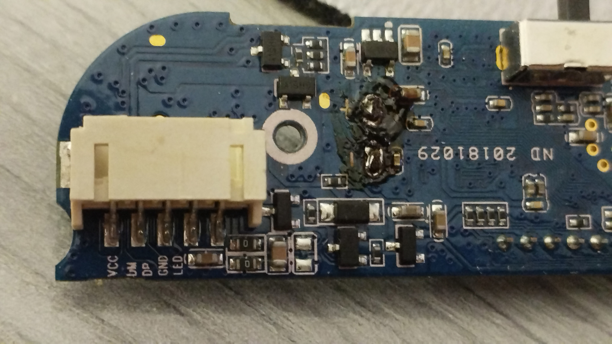
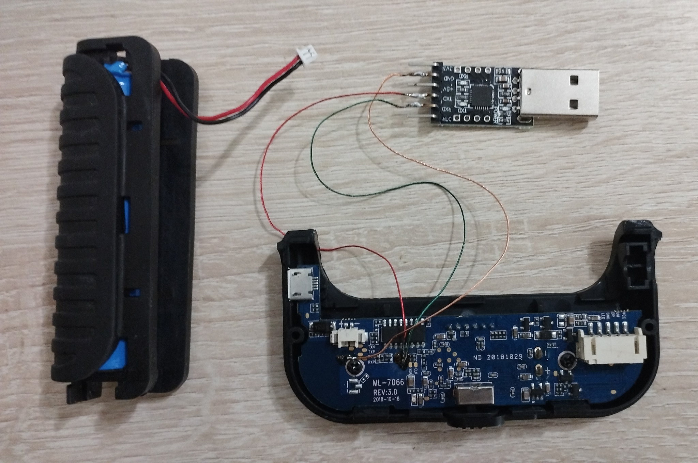
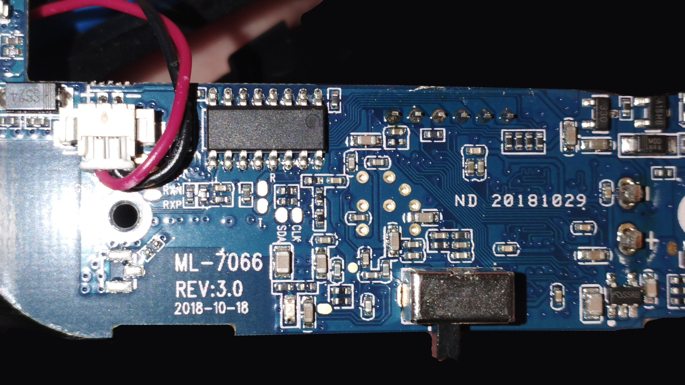
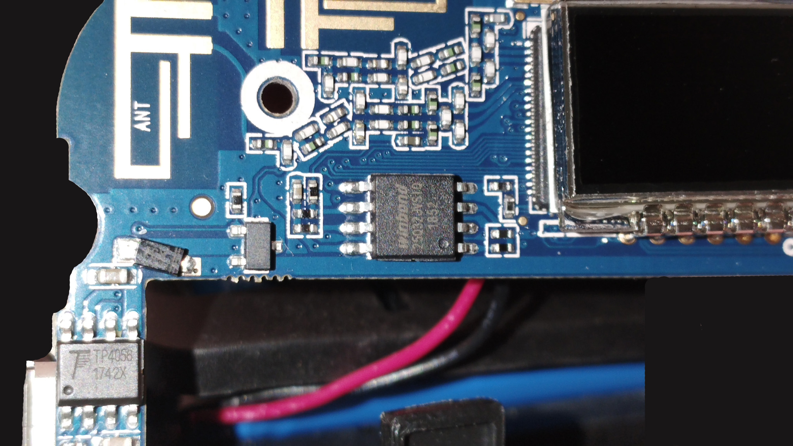

# ENDOSCOPE: Устройство И Текущее Состояние

Паспорт конкретной платы и актуальное состояние проекта.

## Текущее Состояние

Устройство рабочее. Прошитый образ:

```text
dumps\verified\mtd4_at_wpa2_airtools_wn723n_20260920.bin
size:   3866624
sha256: 7443772442fbbc038305f75659d8b628b319b1da73f99f699a43904f8271124d
```

Management AP:

```text
SSID: AT
Authentication: WPA2-Personal
Cipher: CCMP
Password: 12345678
BSSID: e8:ab:fa:ae:6e:a1
Channel: 11
IP: 192.168.10.123
```

Проверено после прошивки:

```text
boot OK
ping 192.168.10.123 OK
TCP 23 open
TCP 80 open
8188eu loaded
mt_wifi loaded
ra1 = AP/control
wlan0 = monitor, type 803
airtools UDP/8088 responds
```

Оригинальный bootloader восстановлен:

```text
dumps\original\mtd1_bootloader.bin
size:   196608
sha256: 9012c77628e5a7724d7fea2641399978089445cfc655671ee872741725ca31b6
```

Не писать `mtd1/mtd2/mtd3` без отдельного решения. Практические правила flash/recovery: [BRICK.md](BRICK.md).

## Плата

По фотографиям платы:

```text
ML-7066 REV:3.0
2018-10-18
```

Фотографии:

<table>
  <tr>
    <td align="center"><a href="images/1789899357000.jpg"></a><br><sub><code>1789899357000.jpg</code></sub></td>
    <td align="center"><a href="images/1789901537903.jpg"></a><br><sub><code>1789901537903.jpg</code></sub></td>
    <td align="center"><a href="images/1789901537912.jpg"></a><br><sub><code>1789901537912.jpg</code></sub></td>
  </tr>
  <tr>
    <td align="center"><a href="images/1789901537920.jpg"></a><br><sub><code>1789901537920.jpg</code></sub></td>
    <td align="center"><a href="images/1789901537927.jpg"></a><br><sub><code>1789901537927.jpg</code></sub></td>
  </tr>
</table>

## UART

Test pads:

```text
GND          земля
R / T        UART RX/TX
TXN/TXP      дифференциальная пара, не UART
RXN/RXP      дифференциальная пара, не UART
SDA/CLK      назначение требует отдельной проверки
```

Подключение CP2102/USB-UART:

```text
CP2102 GND -> GND на плате
CP2102 RXD -> T на плате
CP2102 TXD -> R на плате
Питание 5V/3V3 с CP2102 не подключать
```

Параметры:

```text
COM3, 57600 8N1, flow control: none
prompt: #
```

UART даёт shell без штатного Telnet-входа.

## Hardware / Boot

Из UART boot output:

```text
U-Boot 1.1.3 (Aug  9 2018 - 17:34:36)
Board: Ralink APSoC DRAM:  64 MB
Ralink UBoot Version: 5.0.0.0
ASIC 7628_MP
CPU freq = 580 MHZ
find flash: W25Q32BV
BusyBox v1.23.0 (2018-03-30 18:02:20 CST)
```

CPU:

```text
system type : MT7628
cpu model   : MIPS 24Kc V5.5
```

SPI flash:

```text
model: W25Q32BV
manufacturer id: ef
device id: 40 16
size: 4 MiB
```

Flash layout:

| dev  | size     | erasesize | name       |
|------|----------|-----------|------------|
| mtd0 | 00400000 | 00010000  | ALL        |
| mtd1 | 00030000 | 00010000  | Bootloader |
| mtd2 | 00010000 | 00010000  | Config     |
| mtd3 | 00010000 | 00010000  | Factory    |
| mtd4 | 003b0000 | 00010000  | Kernel     |

Mount layout:

```text
rootfs on / type rootfs (rw)
none on /var type ramfs
none on /dev type ramfs
none on /etc type ramfs
none on /tmp type ramfs
none on /media type ramfs
```

Вывод: `/etc`, `/tmp`, `/var`, `/dev`, `/media` не являются persistence storage без отдельного механизма сохранения.

## Заводские Дампы

```text
dumps\original\flash_full_mtd0.bin   size=4194304 sha256=C11AD67DE1A32884BE18A00655CAA75FE0CB883520F1F422A629009DA72E3967
dumps\original\mtd1_bootloader.bin   size=196608  sha256=9012C77628E5A7724D7FEA2641399978089445CFC655671EE872741725CA31B6
dumps\original\mtd2_config.bin       size=65536   sha256=19F1E55B1DC8E23DFC9DC94A5343EA05EC6352464F7BFF99C76ADBF9EA78E607
dumps\original\mtd3_factory.bin      size=65536   sha256=62755F6E645C3C0F7D20BD348D11AC7668A2C2254DE4AA325298EA808F86B0CD
dumps\original\mtd4_kernel.bin       size=3866624 sha256=72904FD990D724D81CF2EBD3C1E812954C55422442D16CAB7C0E152FF3610C2D
```

`dumps\original\` не перезаписывать. Проверенные modified images лежат в `dumps\verified\`; временный output сборки идет в `dumps\modified\`.

## Что Ещё Проверить

- Механизм постоянного сохранения настроек во flash.
- Назначение `SDA`/`CLK`.
- Есть ли полноценный USB data-интерфейс самого эндоскопа.
