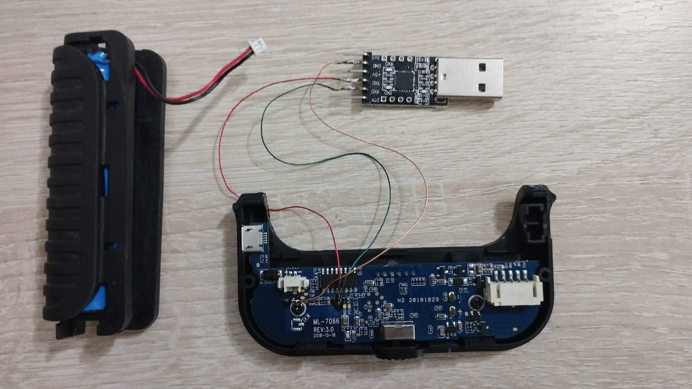
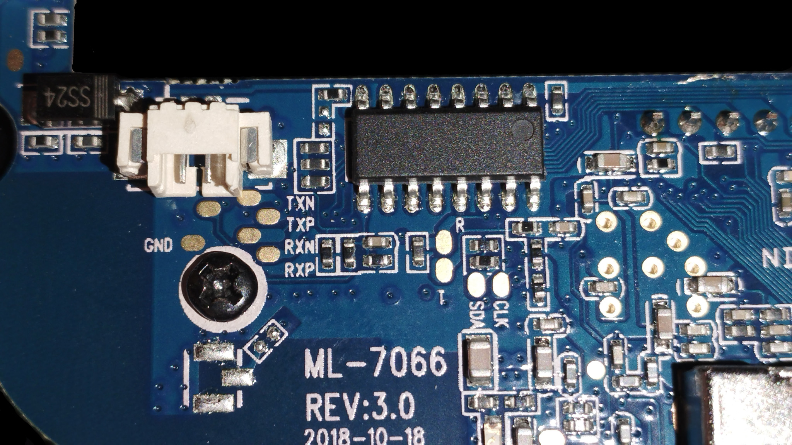
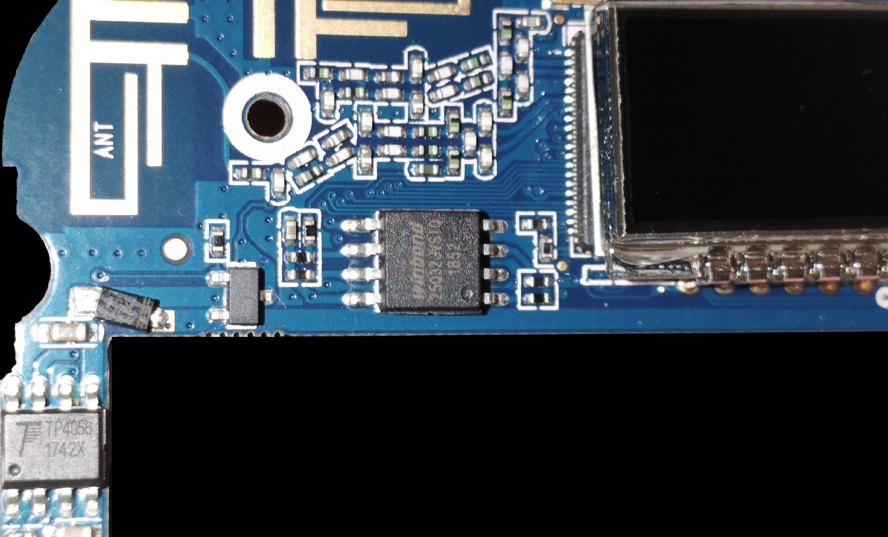
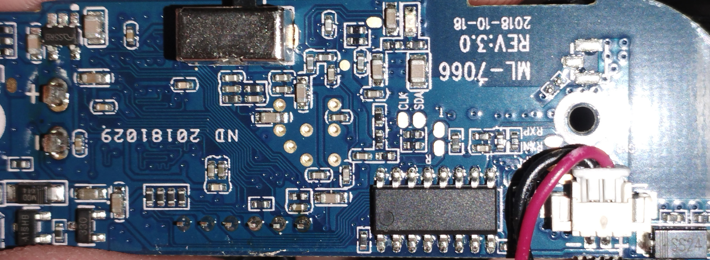

# ENDOSCOPE: характеристики нашего устройства

Этот файл содержит только то, что было получено на нашем экземпляре через фото, UART, Windows/USB/Wi-Fi проверки и сохранённый дамп flash.

## Источники внутри проекта

### Фото платы

Нажать на превью, чтобы открыть оригинальный файл.

<p>
  <a href="images/1789499849818.jpg"></a>
  <a href="images/1789489367549.jpg"></a>
  <a href="images/1789487224948.jpg"></a>
  <a href="images/1789487224941.jpg"></a>
</p>

### Системная информация

- [Linux system inventory](SYSTEM.md)

## Плата

По фотографиям платы:

```text
ML-7066 REV:3.0
2018-10-18
```

Все фотографии перечислены выше в разделе [Фото платы](#фото-платы). Превью кликабельные и ведут на оригинальные `.jpg`.

## Test pads и UART

Найденные площадки:

```text
GND          земля
R / T        UART RX/TX
TXN/TXP      дифференциальная пара, не UART
RXN/RXP      дифференциальная пара, не UART
SDA/CLK      назначение требует отдельной проверки
```

Подключение CP2102/USB-UART:

```text
CP2102 GND -> GND на плате
CP2102 RXD -> T на плате
CP2102 TXD -> R на плате
Питание 5V/3V3 с CP2102 не подключать
```

Параметры UART:

```text
COM3, 57600 8N1, flow control: none
```

Подключение:

```powershell
D:\PROJECTS\ENDOSCOPE\scripts\connect-endoscope-uart.bat
```

## USB

USB-подключение самого эндоскопа к Windows не дало нового PnP-устройства. По результату этой проверки USB не рассматривается как подтверждённый data-интерфейс.

CP2102 USB-UART определился отдельно как:

```text
Silicon Labs CP210x USB to UART Bridge (COM3)
VID_10C4&PID_EA60
```

## Wi-Fi и сеть

Наш компьютер был подключен к AP устройства:

```text
SSID: ENDOSCOPE
PC IP: 192.168.10.36/24
device/gateway IP: 192.168.10.123
BSSID/MAC: E8:AB:FA:AE:6E:A1
channel: 11
```

ARP подтвердил устройство по адресу `192.168.10.123` с MAC `E8-AB-FA-AE-6E-A1`.

Проверенные TCP-порты:

```text
23/tcp   open    Telnet, banner: MoLink login:
7060/tcp open    app_cam video stream server
22/tcp   closed  SSH недоступен
```

## Boot / UART

Из UART boot output нашего устройства:

```text
U-Boot 1.1.3 (Aug  9 2018 - 17:34:36)
Board: Ralink APSoC DRAM:  64 MB
Ralink UBoot Version: 5.0.0.0
ASIC 7628_MP
CPU freq = 580 MHZ
find flash: W25Q32BV
BusyBox v1.23.0 (2018-03-30 18:02:20 CST)
starting pid 249, tty '/dev/ttyS1': '/bin/sh'
```

После загрузки через UART доступен shell prompt:

```text
#
```

UART даёт shell без штатного Telnet-входа.

## Linux

CPU из `/proc/cpuinfo`:

```text
system type : MT7628
cpu model   : MIPS 24Kc V5.5
```

Процессы, которые видели в `ps`, включали:

```text
init
nvram_daemon
app_detect
app_cam
udhcpd /etc_ro/udhcpd.conf
telnetd
/bin/sh
```

## Flash

SPI flash из boot log:

```text
model: W25Q32BV
manufacturer id: ef
device id: 40 16
size: 4 MiB
```

Разметка flash из `/proc/mtd`:

| dev  | size     | erasesize | name       |
|------|----------|-----------|------------|
| mtd0 | 00400000 | 00010000  | ALL        |
| mtd1 | 00030000 | 00010000  | Bootloader |
| mtd2 | 00010000 | 00010000  | Config     |
| mtd3 | 00010000 | 00010000  | Factory    |
| mtd4 | 003b0000 | 00010000  | Kernel     |

Mount layout:

```text
rootfs on / type rootfs (rw)
proc on /proc type proc (rw,relatime)
none on /var type ramfs (rw,relatime)
none on /dev type ramfs (rw,relatime)
none on /etc type ramfs (rw,relatime)
none on /tmp type ramfs (rw,relatime)
none on /media type ramfs (rw,relatime)
none on /sys type sysfs (rw,relatime)
```

Вывод: изменения в `/etc`, `/tmp`, `/var`, `/dev`, `/media` не нужно считать постоянными без отдельной проверки механизма сохранения во flash.

## Дамп flash

Полный дамп SPI flash снят через Wi-Fi: Telnet используется для запуска `busybox tcpsvd`, а Windows принимает raw-поток `/dev/mtd0` по TCP.

- [Полный flash, mtd0](dumps/original/flash_full_mtd0.bin) — 4194304 bytes, SHA256 `C11AD67DE1A32884BE18A00655CAA75FE0CB883520F1F422A629009DA72E3967`
- [Bootloader, mtd1](dumps/original/mtd1_bootloader.bin) — offset `0x000000`, size `0x030000`, SHA256 `9012C77628E5A7724D7FEA2641399978089445CFC655671EE872741725CA31B6`
- [Config, mtd2](dumps/original/mtd2_config.bin) — offset `0x030000`, size `0x010000`, SHA256 `19F1E55B1DC8E23DFC9DC94A5343EA05EC6352464F7BFF99C76ADBF9EA78E607`
- [Factory, mtd3](dumps/original/mtd3_factory.bin) — offset `0x040000`, size `0x010000`, SHA256 `62755F6E645C3C0F7D20BD348D11AC7668A2C2254DE4AA325298EA808F86B0CD`
- [Kernel, mtd4](dumps/original/mtd4_kernel.bin) — offset `0x050000`, size `0x3B0000`, SHA256 `72904FD990D724D81CF2EBD3C1E812954C55422442D16CAB7C0E152FF3610C2D`

`dumps\original\` содержит неизменяемые заводские recovery-дампы. Готовые модифицированные partition images хранятся отдельно в `dumps\modified\`.

## Что остаётся проверить

- Механизм постоянного сохранения настроек во flash.
- Назначение `SDA`/`CLK`.
- Есть ли полноценный USB data-интерфейс.


